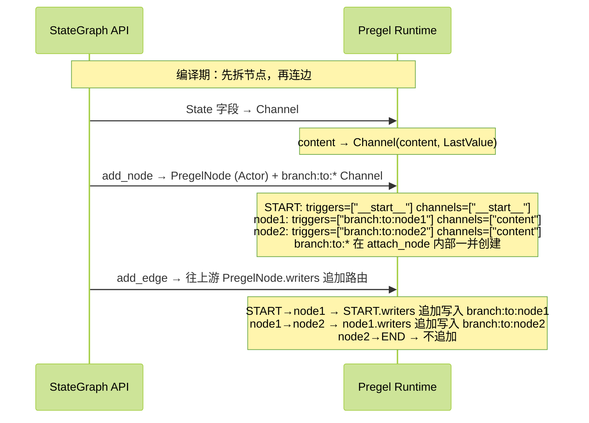

## Pregel 介绍
LangGraph 的工作流引擎基于 Google 的 Pregel 论文，跑的是 BSP（批量同步并行，Bulk Synchronous Parallel）模型。BSP 的核心思想很简单：每一步里所有节点并行跑，跑完统一同步，再进下一步。这样做的好处：同一张图、同样的输入，每次结果都一样（确定性）；每一步结束都有一份完整快照，可以随时暂停、回放、创建分支；没有"A 节点看到 B 节点写了一半数据"这种并发问题。对 AI 工作流来说尤其重要——LLM 调用耗时且有一定随机性，需要随时 checkpoint 和重试，BSP 的"每步一同步"天然匹配这个场景。

前面聊 Stream 和 Event Stream 时，我们已经了解了 Pregel 的产物——tasks、updates、values 这些事件，本质上都是 Pregel 在每个 superstep 吐出来的。这一章，我们钻到引擎里面，看看 Pregel 到底是怎么把一张图跑起来的。

## Actor and Channels

Pregel将工作流分为两大角色 **Actor** 和 **Channel**，Pregel引擎将Actor和Channel串联起来形成一个完整的应用。
- **Actor** 承载具体的节点执行逻辑，从Channel中读取数据，完成逻辑执行后，将最终输出写入到Channel中，Actor在LangGraph里即是**PregelNode**；

- **Channel** 负责Actor之间的通信，通过Channel在不同的**PregelNode**之间共享数据，每个Channel都包含Channel的**类型，Channel的更新类型和更新方法**三个重要的属性；你定义的在AgentState中的每一个属性，在编译Workflow的阶段，都会生成一个单独的channel；

### actor和channels是如何生成的，`compile`

Actor和Channels在graph执行`compile`的时候就会生成，大致的过程如下，
- Graph的State字段中的所有属性，会`compile`为Channel；
- add_node中添加的节点，会`compile`为PregelNode；
- add_edge添加的边，会成`compile`为PregelNode之间的监听关系；



比如如下的一个简单的Workflow，只包含两个节点node1和node2，State中值包含一个content属性:
```python
class AgentState(TypedDict):
    content: str

def Node1(state: AgentState) -> dict:
    return {'content': 'node1'}

def Node2(state: AgentState) -> dict:
    return {'content': 'node2'}

graph = StateGraph(AgentState)
workflow = graph.add_node("node1",Node1)\
					.add_node("node2",Node2)\
					.add_edge(START,"node1")\
					.add_edge("node1","node2")\
					.add_edge("node2",END).compile()
					
print('####nodes:\n')
pprint(workflow.nodes)

print('####channels:\n')
pprint(workflow.channels)
```

把node1和node2构建为graph并`compile`后，可以看到这个简单的graph包含三个节点，
- 起点__START__
- 咱们定义的node1和node2
而每个Node之间的边和AgentState中的属性，`compile`成了独立的Channel:
```shell
####nodes:

{'__start__': <langgraph.pregel._read.PregelNode object at 0x1061201a0>,
 'node1': <langgraph.pregel._read.PregelNode object at 0x1060b5d10>,
 'node2': <langgraph.pregel._read.PregelNode object at 0x1060b6350>}

####channels:
{'__pregel_tasks': <langgraph.channels.topic.Topic object at 0x106140980>,
 '__start__': <langgraph.channels.ephemeral_value.EphemeralValue object at 0x106140900>,
 'branch:to:node1': <langgraph.channels.ephemeral_value.EphemeralValue object at 0x106140bc0>,
 'branch:to:node2': <langgraph.channels.ephemeral_value.EphemeralValue object at 0x1059f6840>,
 'content': <langgraph.channels.last_value.LastValue object at 0x102db2200>}
```

我们从PregelNode的源码中看看PregelNode包含很多属性，其中，最重要的属性是`channels`、`triggers`和`writers`:
- `channels`，表示要传入到Node执行逻辑的channels，Node从这些channels中取值执行Node定义的业务逻辑；
- `triggers`，表示该Node订阅的channel，用于触发node的执行逻辑；
- `writers`，表示PregelNode的业务逻辑执行完成之后，通过writers来向对应的channel写入更新；
另外，`mapper`用于将输入channel的值进行转换后送入到Node的执行容器`bound`中执行；

```python
class PregelNode:
    """A node in a Pregel graph. This won't be invoked as a runnable by the graph
    itself, but instead acts as a container for the components necessary to make
    a PregelExecutableTask for a node."""

    channels: str | list[str]
    """The channels that will be passed as input to `bound`.
    If a str, the node will be invoked with its value if it isn't empty.
    If a list, the node will be invoked with a dict of those channels' values."""

    triggers: list[str]
    """If any of these channels is written to, this node will be triggered in
    the next step."""

    mapper: Callable[[Any], Any] | None
    """A function to transform the input before passing it to `bound`."""

    writers: list[Runnable]
    """A list of writers that will be executed after `bound`, responsible for
    taking the output of `bound` and writing it to the appropriate channels."""

    bound: Runnable[Any, Any]
    """The main logic of the node. This will be invoked with the input from 
    `channels`."""
    
    ...
```

再看看咱们这个最简单的workflow中的node1被compile成Pregel Node之后，这几个关键属性的属性值是怎样的，
- Node1的方法将AgentState作为入参，AgentState的`content`属性，会被写入到node1的channels属性；如果AgentState有多个属性，每个属性都会作为独立的channels出现在node的channels订阅列表中；
- triggers的值是 `branch:to:node1`。这个表示，node1的执行逻辑会被这个channel触发；
- writers的值包含两个对象，一个ChannelWrite是用于将Node的逻辑执行完成之后的返回值通过mapper写入content channel，另一个ChannelWrite是用于触发下一步Node2的逻辑；

```shell
***node: node1:
node1 subscribe channels: ['content']

node1 triggers: ['branch:to:node1']

node1 writers:
[ChannelWrite<...,...>(tags=None, recurse=True, explode_args=False, func_accepts={'config': ('N/A', <class 'inspect._empty'>)}, writes=(ChannelWriteTupleEntry(mapper=<function CompiledStateGraph.attach_node.<locals>._get_updates at 0x10614c680>, value=<object object at 0x102c86580>, static=None), ChannelWriteTupleEntry(mapper=<function _control_branch at 0x1061379c0>, value=<object object at 0x102c86580>, static=[]))),
 ChannelWrite<branch:to:node2>(tags=None, recurse=True, explode_args=False, func_accepts={'config': ('N/A', <class 'inspect._empty'>)}, writes=(ChannelWriteEntry(channel='branch:to:node2', value=None, skip_none=False, mapper=None),))]
```

### 执行阶段, 每一步的 Plan → Execution → Update

`compile`之后，工作流运行时的每一步，都是在执行 **Plan → Execution → Update** 三个阶段：
- **Plan（规划）**：即扫描所有 Channel，找出上一步被更新过的 Channel， 看看那些PregelNode订阅了该channel。即找到更新的channel，从各个Node的triggers里找到谁订阅了这些channel；比如START完成后触发了branch:to:node1，找到Plan时找到了node1的triggers属性订阅了这个通过，于是触发Node1的执行；
- **Execution（执行）**：把上一步 Plan 选出来的节点**并行**跑起来，各自从订阅的 Channel 读输入、执行逻辑，把结果写入自己的 writes 列表。这一步里任何节点对 Channel 的写入，对其他节点**都不可见**——大家看到的还是上一步的快照。比如Node1被选中后，从channels取到`content`值开始执行逻辑，逻辑执行完成后，等待update阶段将最终值更新到`content`的channel；
- **Update（更新）**：等这一批节点全部跑完，再把它们 writes 列表里的写入**统一刷进对应的 Channel**，并清除本步的瞬时值。到这一步，新的状态才对其他节点可见，进入下一个 superstep。

>第一步没有"上一步"，所以触发的是订阅了 input channel（`__start__`）的节点。

正是这个"本步隔离、下一步才可见"的约束，让 Pregel 的执行结果可复现——同一张图、同样的输入，每次跑出来的步骤和结果都一样。

那么 Pregel 怎么知道该停了？当一个 superstep 跑完所有节点后，没有任何 Channel 被写入（也就是没有新的 trigger 产生），Pregel 就知道没活干了，结束。

因为 BSP 每步结束都有一份确定的状态快照（checkpoint），LangGraph 才能在任意步暂停、回放、创建分支（时间旅行）。


### Channel 包含哪些类型呢 

如我们开头所说，每个channel都有值类型，更新类型，和更新方法，从workflow的输出，我们可以看到，

- AgentState的content属性，是LastValue类型，他表示这个类型的channel接受的是每个node节点逻辑处理完成之后的最终值，即表示如果node的处理逻辑最终返回了需要更新这个属性值，这个属性值会被最新的值刷新；
- Workflow的边被定义为 EphemeralValue，表示瞬时值，用于 node 的 trigger 订阅，也用于输入通道（比如 `__start__` 就是用 EphemeralValue 接收外界输入的）；
-

```shell
{'__pregel_tasks': <langgraph.channels.topic.Topic object at 0x106140980>,
 '__start__': <langgraph.channels.ephemeral_value.EphemeralValue object at 0x106140900>,
 'branch:to:node1': <langgraph.channels.ephemeral_value.EphemeralValue object at 0x106140bc0>,
 'branch:to:node2': <langgraph.channels.ephemeral_value.EphemeralValue object at 0x1059f6840>,
 'content': <langgraph.channels.last_value.LastValue object at 0x102db2200>}
```

### LastValue and BinaryOperatorAggregate
用得最多的 Channel 类型就是LastValue和BinaryOperatorAggregate，
- **LastValue**，是AgentState的默认Channel类型，每个node执行完成时覆盖写入；
- **`BinaryOperatorAggregate`**，可以指定channel值更新方式的channel类型，按照指定的规约方法进行值的合并，比如定义AgentState属性时，通过Annotated指定了值的更新方式，如下；

```python
class AgentState(TypedDict):
	content: Annotated[str,lambda old,new: old +new]
```

通过Annotated指定后，content在`compile`之后的channel类型如下，
```shell
 'content': <langgraph.channels.binop.BinaryOperatorAggregate object at 0x107cec7c0>}
```

### Topic
从 workflow.channels的输出中，可以看到 workflow 包含一个特殊的 Channel 对象，使用的是 Topic Channel 类型: 
`'__pregel_tasks': <langgraph.channels.topic.Topic object at 0x106140980>`，
`__pregel_tasks` 是 LangGraph 内部用于**任务调度和控制**的一个核心通道（Channel）。
Topic提供了PubSub的机制，用于通知SuperStep间执行过程的调度，在工作流的业务代码中不直接使用。

### DeltaChannel
此外，值得关注的还有**DeltaChannel**，DeltaChannel比较有用的一个场景就是在Workflow处理的场景，不断需要与AI交互时存储message的场景，因为workflow的checkpoint保存的是node执行完成的完整快照，如果message在各个node之间在传递，那么每个checkpoint都会保存很多冗余的message信息，而DeltaChannel在checkpoint快照中保存的是每个步骤写入的新消息，读取时才会去读取完整的消息列表，从而降低了空间消耗。


## 直接使用Pregel创建工作流

```python

from langgraph.pregel import Pregel, NodeBuilder
from langgraph.channels import EphemeralValue, Topic

def node1_func(x: str) -> str:
    return x + x

def node2_func(x: dict) -> str:
    return x["b"] + x["b"]

# 构建两个节点
node1 = (
    NodeBuilder()
    .subscribe_only("a")
    .do(node1_func)
    .write_to("b", "c")
)

node2 = (
    NodeBuilder()
    .subscribe_to("b")
    .do(node2_func)
    .write_to("c")
)

app = Pregel(
    nodes={"node1": node1, "node2": node2},
    channels={
        "a": EphemeralValue(str),
        "b": EphemeralValue(str),
        "c": Topic(str, accumulate=True),
    },
    input_channels=["a"],
    output_channels=["c"],
)

result = app.invoke({"a": "foo"})
print(result)
```

最后，咱们看个官方示例，看看如何使用Pregel直接创建工作流，从代码中工作流的定义可以看到，创建Pregel工作流时，指定了工作流运行时的Channels: a / b / c ，分别是EphemeralValue 和 Topic类型 (并且是累计类型)，而后指定了 输入、输出channels 分别是 a  和 c；

通过NodeBuilder创建node时，指定node的订阅channel，执行逻辑和输出channel，比如 node1订阅了channels a，执行 node1_func 的逻辑处理输入值，输出值写入到topic类型的channel c；

注意，输出channel是accumulate的topic，因此在node1和 node2往 channel c写入的值，都会输出到最终的执行结果

```shell
{'c': ['foofoo', 'foofoofoofoo']}
```


## 总结
如上就是LangGraph 工作流底层引擎Pregel的一些基本内容，回顾一下要点:

- **Pregel 是 LangGraph 的运行时**，名字来自 Google 的 Pregel 论文，跑的是 BSP（批量同步并行）模型。你平时写的 Graph API，编译后本质上就是一套 Pregel 应用。
- **编译期的映射是理解 Pregel 的钥匙**：
	- State 里每个字段 → 一个 Channel；
	- 每条 add_edge → 一个 `branch:to:*` Channel；
	- 每个 add_node（ START）→ 一个 PregelNode。
	每个 PregelNode 装着 channels（读什么）、triggers（谁触发我）、writers（写到哪）三个要素。
- **运行时每一步都是 Plan → Execution → Update**：Plan 找出该跑的节点 → Execution 并行执行，本步写入互相不可见 → Update 统一刷进 Channel。如此循环，直到没有新的 Channel 被写入就结束。这个"本步隔离、下一步才可见"正是 BSP 确定性的来源。


更详细的内容参考官方文档，[Pregel](https://docs.langchain.com/oss/python/langgraph/pregel)
