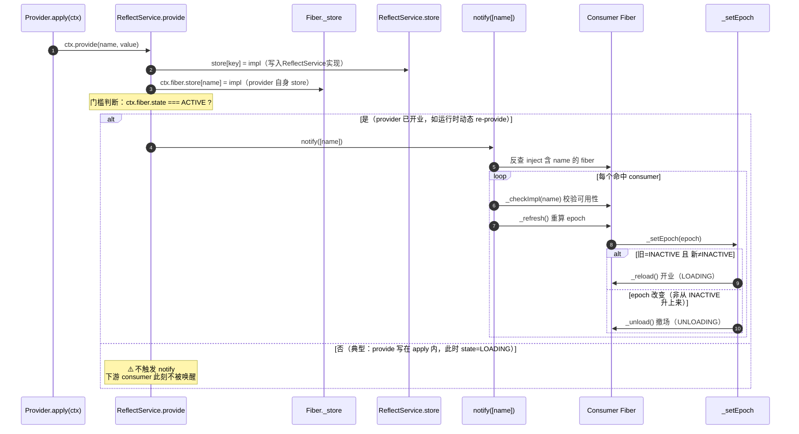

# cordis 核心工作原理

## 从一个故事开始

有一座孔太斯大楼（Context），瑞迪星咖啡集团（插件）想到这里开店；
  
大楼要求每家到这里提供的服务供应商，开店和闭店都必须准备好标准流程，店铺由大楼委派的店长来运营；
  
店长负责要根据集团要求确认自己店铺能不能营业，营业依赖的条件何时能够满足，由楼管来通知；


### **开店申请。**
  
星瑞迪向大楼的招商引资办（registry）递交一份开店申请：必须写明店名（`name`），以及开店必需的资源需求（`inject`，比如"需要供水、需要供电"）。
  
招商办受理后在名册上建一页（Runtime），签发一份入驻协议，并派下一位店长（fiber），咖啡店被分配在一楼A01（插件子 Context）。

### **店长核对资源。等待开业**
  
店长上岗第一件事，是拿着资源需求清单去找楼管（reflect）核对：供水供电现在能不能被满足。
  
如果满足了就直接营业，如果还没有满足，店长就去店铺门口坐着等（PENDING），连招牌桌椅都不能摆——这些布置要等正式开业才能动手。
  
此后只要有人来大楼里提供服务，招商引资办都会通知楼管。楼管挨个通知名册上依赖这个服务的店长，由店长自己核对所有依赖的服务是不是都满足了，是否能够营业。
  
楼管会就"某家店状态变了"发广播（对应 `internal/status` 事件）：哪家店开业了、停业了，凡是订阅了这个消息的店都会收到，跟着开或跟着停，一家倒，靠它的店也跟着倒。

### **咖啡店开业**
  
没过多久，供水供电的供应商也通过招商引资办(registry)完成了注册，楼管挨个通知已经提交过营业申请并依赖供水供电的店铺店长(fiber)；

咖啡店长核实到依赖都齐了，于是店长按照瑞迪星集团的标准流程着手开始布置店铺，摆好桌椅，挂好招牌，开门营业。这些布置每做一样，
  
店长都顺手记在协议附件上，写明"停业时怎么收"——布置只在开业这几天存在，停业那天一律照单收回。

大楼还提供了一块公共的公告牌，提供服务的商家都可以往公告牌写上自己的服务信息，但是大楼要求商家往公告牌记录的同时要安排好停服时擦除(effect and dispose)；

### **咖啡店意外停业、恢复**
  
有一天，供水服务的水管爆了。楼管发现了这个情况，赶紧挨个通知各个店长，店长发现咖啡店依赖清单里的"供水"空了，赶紧关停了咖啡店，收起招牌、桌椅，公告牌也擦除了，回到门口等待(pending)楼管通知供水服务恢复。
  
好在没多久供水服务就恢复了，楼管第一时间通知了店长重新营业，于是店长又重新摆好桌椅，挂起招牌，往公共牌重新记录上服务信息。

### **秘书处。**
  
大楼还有个秘书处（logger），是开盘时就驻好的常设机构，默默把楼里发生的每件事写进台账：谁办了手续、谁开了业、谁停了业。

### **广播系统。**
  
大楼提供一套广播系统（event），供各店按兴趣订阅频道。订阅的方式都一样，但是发广播的方式有如下花样，

- **广播，发完不管(emit)。** 比如供水部门今晚发一条（`emit`） 广播"今晚 6 点停水"，所有订阅了供水频道的店各自做好应对，供水部门可不管你怎么应对。
- **广播，全员按顺序响应(waterfall)** 比如供水商要改造水路管线，需要商户逐个反馈改造影响，每家商户反馈完要主动通知下家继续反馈。
- **广播, 等全员响应。(parallel)** 还是涨价这类公告，如果大楼要求"必须确认每家都回执了"，就换成 `parallel`——它会 await 所有监听器，等每家都处理完才返回。和 `emit` 的区别就在"大楼等不等回复"。
- **广播，首个应答者拍板。(serial/bail)** 比如供电商希望断电检修，但是不能影响任何商家，于是通过这个应答拍板的方式通知各个上家，收到通知的任意一家商户有影响反馈，就不需要关心其他的反馈了。

# cordis核心工作机制
## context
如上，这个小故事，就是Cordis插件的核心运作机制；

大楼就是所有插件的顶层容器`Context`；
招商办公室即是`registry`，所有的插件注册要通过regisry；
楼管则是`reflect`，任何插件的状态变化，都由`reflect`来通知`fiber`做依赖核对，满足条件就上岗营业；
`events`是挂在`Context`上的事件系统，提供`emit` / `parallel` / `serial` / `bail` / `waterfall`**五种分派模式**，驱动各个插件协同工作；
店长就是`fiber`，提供服务时，对外部资源产生的影响要通过`effect`来注册，并返回擦除影响的方法；

```ts
export interface Context {
  ...
  root: this
  /** Base URL used to resolve relative plugin/module specifiers, if the runtime sets one. */
  baseUrl?: string
  /** The event bus. Its methods are also mixed onto `ctx` (`ctx.on`, `ctx.emit`, ...). */
  events: EventsService
  /** The logging service. Call `ctx.logger(name)` for a named logger. */
  logger: LoggerService
  /** The reflection layer backing the context proxy (`ctx.get`, `ctx.provide`, ...). */
  reflect: ReflectService
  /** The plugin registry. Its methods are mixed onto `ctx` (`ctx.plugin`, `ctx.inject`). */
  registry: RegistryService
}
```

`Context`在顶层定义中持有一个根级别的`fiber`对象，这个fiber其实没有内容；
初始化`Context`的时候，得到的ctx其实是有RelectService的代理。
```ts
//context 初始化：根 fiber 的 inject 为空集合，_refresh() 算出的 epoch 是空串 '' 而非 INACTIVE，
//所以一开局就处于就绪（ACTIVE）状态
  constructor() {
    this[symbols.isolate] = Object.create(null)
    this[symbols.intercept] = Object.create(null)
    const self = new Proxy<this>(this, ReflectService.handler)
    this.root = self
    this.baseUrl = undefined
    this.fiber = new Fiber(self, {}, Object.create(null), null, () => [])
    this.reflect = new ReflectService(self)
    this.registry = new RegistryService(self)
    this.events = new EventsService(self)
    this.logger = new LoggerService(self)
    this.fiber._disposables.clear()
    return self
  }

  [Symbol.for('nodejs.util.inspect.custom')]() {
    return `Context <${this.fiber.name}>`
  }
```
## plugin
所有插件定义，需要声明自己是谁，自己需要什么服务(可选)，自己执行服务的核心逻辑；
```ts
declare module '@deepseek-ai/cordis' {
  interface Context {
    sell: (cups: number) => void
  }
}

export const coffeePlugin = {
  name: 'coffee',
  inject: ['water', 'power'] as const,
  async apply(ctx: Context) {
    // 开业流程：每次依赖就绪都会「重新走一遍」——本班营业账在此归零
    ...

    // 协议附件登记撤场处理（LIFO：后登记的先执行）
    ctx.effect(() => () => ctx.logger.info('撤场：摘下门口的画'))
    ctx.effect(() => () => ctx.logger.info('撤场：停掉订阅的报纸'))
    ...

    ctx.provide('sell', sell)

    // 退租清理：依赖消失时这段被调用，从最后一项往回执行
    return () => {
      ctx.logger.info('咖啡店停业（本班营业账 ' + shiftNote + ' 杯作废；财务部总账仍在）')
    }
  },
}
```

插件通过`registry`提供的`plugin`方法注册，通过`inject`来声明依赖，这里的依赖是对服务的依赖；
插件通过`ctx.plugin`注册时，会检查依赖能否被满足，不满足的话就进入PENDING状态，直到服务满足后变成ACTIVE；
```ts
// 注册插件，返回与 fiber 绑定的 PromiseLike（其 .then 委托给 fiber.await()）
const coffee = ctx.plugin({
  name: 'coffee',
  inject: ['water', 'power'],   // 开业条件条款（依赖）
  apply(ctx) { /* 依赖就绪后才执行，即真正的开业 */ },
})
```

如果要让别的插件使用你的服务，需要要把自己提供的服务扩展到`context`中(如下declare的内容)，并且在你的插件ready的时候，主动将服务`provide`出来，或者使用扩展Service的方式来声明你的插件；
对外提供的服务，要通过`declare`的方式扩展到Context中，不然别的插件代码使用你的服务是，代码会飘红；
```ts
declare module '@deepseek-ai/cordis' {
  interface Context {
    sell: (cups: number, seller?: string) => void
  }
}

export const coffeePlugin = {
  name: 'coffee',
  inject: ['water', 'power', 'finance'] as const,
  async apply(ctx: Context) {
    ...

    ctx.provide('sell', sell)

    ...
  },
}
```

### 插件声明的3种方式
插件声明有三种方式，函数、对象、Service

#### 函数插件

首先是函数插件，如下即是最方便的函数插件，大部分只需要消费其他插件提供的服务能力的插件，通过函数形式定义即可
```ts
import { Service, type Context } from '@deepseek-ai/cordis'
const name = 'myplugin'
const inject = ['a','b']
export function apply(ctx: Context) {}
```

#### 对象插件
第二种是 对象插件，如下是在咱们的样例里使用的 coffeePlugin(瑞迪星集团)
```ts
// coffee.ts:17-19
export const coffeePlugin = {
  name: 'coffee',
  inject: ['water', 'power'] as const,   // ← 开业条件条款：缺一项 apply 不跑
  async apply(ctx: Context) { ... }      // ← 依赖就绪后才执行，即真正的开业
}
```
对于coffee这类业务插件，通过如上注册，等待Cordis的调度，满足依赖条件之后，开始运行自身的逻辑就可以了；
如果希望你的插件服务也可以被其他插件使用，比如咱们的例子里，面包店希望和咖啡店合作，卖咖啡，coffee就需要把自己的能力在apply的时候`provide`出来；
```ts
ctx.provide('sell', sell)            // ← 把「咖啡店 fiber」也挂出去，方便楼外 await
```
如果你的插件不对外提供服务，使用对象插件或者更方便的函数插件的方式就可以了。

#### Service 插件：
第三张就是Service类型的插件，Service插件除了自身往context注册外，还会将Service扩展到context，以供其他插件调用服务；
可以看到Service类的的构造函数中调用了`reflect.provide`;
```ts

export abstract class Service<out T = never> {
  //Service类构造函数构造函数
  constructor(protected ctx: Context, name: string) {
    name ??= this.constructor['provide'] as string
    ...
    self.ctx.reflect.provide(name, self, this[symbols.check])
    return self
  }
}
```

比如咱们的WaterService的supply方法，提供给依赖他的插件来调用；
```ts
export class WaterService extends Service {
  constructor(ctx: Context) {
    super(ctx, 'water')
    ctx.logger('water').info('供水部门挂牌（大厦公用）')
  }
  supply(): string {
    return '自来水'
  }
}
```


### Fiber
插件注册后，得到的是`fiber`对象，也就是上面故事里的店长，`fiber`是插件注册到`Context`后的真正运行对象；

```ts
// fiber（店长）—— 插件注册到 Context 后的真正运行对象，由 registry 在受理申请时 new 出来
class Fiber {
  // ① 开业条件条款（门禁）：声明需要哪些服务，缺一项 apply 不跑，咖啡店停在 PENDING
  inject: string[]

  // ② 生命周期状态机：状态由 epoch 跃迁 + _error + 是否 disposed 共同决定
  //    DISPOSED(dispose 已调) / FAILED(_reload 抛错，_error 被记) / ACTIVE(依赖齐) / PENDING(epoch=INACTIVE)
  //    LOADING · UNLOADING 是开业 / 撤场进行中的瞬态
  //    注：uid 只是 epoch 字符串里编码"依赖来自哪个 provider"的片段，不是独立参与状态计算的变量
  get state(): FiberState

  // ③ 开业流程本体：就是插件写的 apply，只有依赖就绪（epoch 翻成非 INACTIVE）时
  //    fiber 自己 _reload() → _execute(runtime.callback) 才执行——"依赖齐了才开业"是 fiber 决定的
  runtime: { callback: (ctx, config) => void }

  // ④ 撤场清单：所有 ctx.effect 登记项都收进这里，退租时倒序（LIFO）执行
  _disposables: DisposableList
  dispose(): PromiseLike<void>

  //⑤  决策权在 fiber 自己：reflect 通知依赖变了，fiber 读自己的 store 自己翻牌
  //    依赖齐 → _reload 开业；依赖没 → _unload 撤场（reflect 只传声，不喊开业）    
  _refresh(): void
  _setEpoch(epoch: string): void
  _reload(): PromiseLike<void>
  _unload(): PromiseLike<void>
  _checkImpl(name: string)

}
```

#### Provide
插件注册后，如果要对外提供服务，如咱们之前所说，是要通过provide来激活服务的(挂牌)，

```ts
  //reflect provide & notify
  provide(name: string, value?: any, check?: () => boolean) {
    return this.ctx.fiber.effect(() => {
      if (!this.props[name]) {
        this.props[name] ??= { type: 'service' }
      } else if (this.props[name].type !== 'service') {
        throw new Error(`property "${name}" is already declared as ${this.props[name].type}`)
      }
      this.props[name] = { type: 'service' }

      this.ctx.root[symbols.isolate][name] ??= Symbol(name)
      const key = this.ctx[symbols.isolate][name]
      const impl: Impl = { name, value, fiber: this.ctx.fiber, check }
      if (this.store[key]) {
        throw new Error(`service "${name}" has been registered at <${this.store[key].fiber.name}>`)
      }
      this.store[key] = impl
      this.ctx.fiber.store![name] = impl
      if (this.ctx.fiber.state === FiberState.ACTIVE) {
        this.notify([name])
      }
      return async () => {
        delete this.store[key]
        const fibers = this.notify([name])
        await Promise.allSettled(fibers.map(fiber => fiber.await()))
        // ensure self access before dependencies cleanup
        delete this.ctx.fiber.store![name]
      }
    }, `ctx.provide(${JSON.stringify(name)})`)
  }

  notify(names: string[], filter = (ctx: Context, name: string) => ctx[symbols.isolate][name] === this.ctx[symbols.isolate][name]) {
    const fibers: Fiber[] = []
    for (const runtime of this.ctx.registry.values()) {
      for (const fiber of runtime.fibers) {
        let hasUpdate = false
        for (const name of names) {
          if (!(name in fiber.inject)) continue
          if (!filter(fiber.ctx, name)) continue
          hasUpdate = true
          fiber._checkImpl(name)
        }
        if (!hasUpdate) continue
        fiber._refresh()
        fibers.push(fiber)
      }
    }
    for (const name of names) {
      const self: Context = Object.create(this.ctx)
      self[symbols.filter] = (target: Context) => filter(target, name)
      this.ctx.events.emit(self, 'internal/service', name, this._getImpl(name, false)?.value)
    }
    return fibers
  }
```
整个激活的过程是一个级联检查的过程，如下，
某个插件的服务ready后，通过调用 ctx.provide(name, value)，新挂牌提供的服务作为自身(fiber)的副作用注册，服务名称必须唯一，
新provide的服务信息写入fiber自己的store和reflectService的store中供后续的状态变更和全局检查是使用；
写完后卡一道门槛，只有提供服务的fiber自己已经 ACTIVE（开业状态）时，才触发 notify([name])。
notify 拿着服务名，只扫那些 inject 里声明要这个服务的 consumer fiber（不扫全场），逐个调 _checkImpl 校验、再 _refresh 重算consumer自己的 epoch。
consumer 自己翻牌：_refresh 算出新的 epoch 交给 _setEpoch，开不开业由 consumer 自己定——从"缺依赖"变"齐了"就 _reload 开业；反之就 _unload 撤场。
reflect 只传声，不拍板。
若 consumer 开业时又 `provide` 新服务，就进入下一轮 `notify`，形成级联。



## effect & dispose（副作用与清理）

插件正式提供服务后，对外部资源产生的影响，在cordis里叫做副作用，通过在 `apply` 里通过调用 `ctx.effect(fn)`来声明，框架会立刻执行 `fn()`，并把 `fn` 返回的清理函数收进该插件 fiber 的 `_disposables`；插件依赖消失（撤场）时，框架倒序（LIFO）执行这些清理函数，就是 `dispose`。

在咱们提供的样例里，咖啡店服务激活后，在公告牌里写上自己的服务信息，返回的是从公告牌抹去自家服务信息的函数；

```ts
// common.ts —— trackEffect：登记/注销都在 effect 回调里
export function trackEffect(ctx: Context, owner: string, label: string, fn) {
  return ctx.effect(() => {
    ctx.board.add(owner, 'effect', label)     // effect 建立 → 登记
    const dispose = fn()
    return () => {
      if (typeof dispose === 'function') dispose()
      ctx.board.remove(owner, 'effect', label) // effect 清理 → 注销
    }
  }, owner + ': ' + label)
}
```


## events
Cordis 的 event 有五种分派模式：`emit` / `waterfall` / `parallel` / `serial` / `bail`。**用哪种由发送方决定**，不是订阅方。

和 Service 一样，对外可订阅的通知也要先 `declare` 到 `Events` 接口，否则消费方代码会飘红：
```ts
declare module '@deepseek-ai/cordis' {
  interface Events {
    'water/maintenance'(message: string): void
  }
}
```

挨个看。

### emit
纯广播，发完不等待任何返回值。样例里供水商发停水通知就是 emit——怎么应对是各家自己的事，供水商不管。
```ts
// 发送方：发完即走
ctx.emit('water/maintenance', '今晚18:00 停水')

// 订阅方（coffee.ts）：直接用 ctx.on，区别只在发送方用的是 emit
ctx.on('water/maintenance', (message) =>
  ctx.logger.info('[咖啡店] 收到停水通知：' + message + ' → 提前蓄水'),
)
```
DSH的场景里大量使用了emit来广播agent状态的变化，，典型有AGENT状态的变化，工具注册表变动，提示词变化等等；

### waterfall
发送方发一个初始值，**逐层转包给订阅方**，每个订阅方拿到上一层结果，调 `next()` 交给下一层，最终返回最外层的结果。任一层**不调 `next()` 就等于否决**后续链路（含内置行为）。
```ts
// 发送方（03-events.ts）：把基础电费涨幅层层转包
const rise = ctx.waterfall(
  'power/price-rise',
  '基础电费 +10%',
  (note) => '供电科公告：' + note,   // 内置最内层行为
)

// 订阅方（coffee.ts）：直接用 ctx.on，包裹 next()，在上一层结果后追加自己的转嫁说明
ctx.on('power/price-rise', (note, next) => {
  const r = next()                       // 先让内层/下游处理
  return r + '；[咖啡店] 每杯转嫁 ¥1'   // 再叠加自己的改动，回传上层
})
```
**DSH 场景**：waterfall 是 DSH 里**用得最多的模式**，承载"可插拔的流水线变换"：
- 拼装系统提示词，各插件经 `next()` 追加/改写 section、context、tools。。
- 文件编辑/写入前的**单槽位门禁**。
等等

### parallel
发送方并发派发事件，**等待所有订阅方都处理完（回执）才继续**。语义上等于"我发出的事，必须每家都确认过了"。
```ts
// 发送方（03-events.ts）：同一停水通知改用 parallel —— 等所有订阅方处理完才返回
await ctx.parallel('water/maintenance', '今晚18:00 停水')
console.log('parallel 已返回：所有订阅方都已处理')

// 订阅方：和 emit 一样用 ctx.on，只是这次处理函数会被 await —— 发完所有订阅方才算返回
ctx.on('water/maintenance', async (message) => {
  await ctx.logger.info('[咖啡店] 收到停水通知：' + message + ' → 提前蓄水')
})
```
**DSH 场景**：DSH 核心代码里**几乎不用裸 `parallel`**。

### serial
发送方按注册顺序**逐个**调订阅方，**一旦某个订阅方返回非空值就立刻停**（其余不再执行），并把该值回传。适合"征求意见、首个有效答复即拍板"。
```ts
// 发送方（03-events.ts）：停电前征求意见，首个非空意见即命中
const vote = await ctx.serial('power/outage-vote', 3)

// 订阅方（coffee.ts）：直接用 ctx.on，返回非空即命中，后续订阅方不再被调用
ctx.on('power/outage-vote', (floor) => {
  ctx.logger.info('[咖啡店] 对 ' + floor + ' 楼停电投票：不同意（建议错峰）')
  return '咖啡店：不同意，建议错峰'
})
```
**DSH 场景**：比如turn结束前放serial，hook插件订阅，只要有任意的hook需要检查，就不停；

### bail
和 serial 一样"首个非空值即停"，但**同步**返回。适合"抢占/认领"：谁先返回非空谁赢，后面的不再执行。
在DSH中，bail 集中在客户端输入处理。


# DSH · Cordis 代码样例：孔太斯大楼咖啡店

> 可跑示例（完整代码见 GitHub 仓库 [whoisrio/agent-cookbook · examples/dsh/cordis/coffeeshop](https://github.com/whoisrio/agent-cookbook/tree/main/examples/dsh/cordis/coffeeshop)）：`examples/dsh/cordis/coffeeshop/`
> ```bash
> npx tsx coffeeshop/01-dependency-load.ts   # 演示1：依赖驱动激活 + 执行 sell
> npx tsx coffeeshop/02-water-shutdown.ts    # 演示2：供水停 → 依赖它的插件停业
> npx tsx coffeeshop/03-events.ts            # 演示3：集中事件消息 emit/parallel/waterfall/serial
> ```

---

## 这个样例有什么

咱们快速走读一下，样例模拟一栋楼里开咖啡店，角色分两层：

- 大楼级公用服务（Service 插件）：供水 `WaterService`、供电 `PowerService`、财务 `FinanceService`。供电自己依赖供水（`PowerService.inject=['water']`）。
- 业务租户（普通插件）：咖啡店 `coffeePlugin`（依赖 `water/power/finance`）、自营保洁 `CleaningService`（挂在咖啡店名下，随其退租）、面包店 `bakeryPlugin`（依赖咖啡店提供的 `sell`）、冰箱店 `fridgePlugin` 与空调店 `acPlugin`（都只依赖 `power`）。

依赖关系：

```
power   ← water
coffee  ← water, power, finance
cleaning ← coffee
bakery  ← sell(←coffee)
fridge, ac ← power
```

Cordis 在依赖齐了才让插件开业（`ACTIVE`），缺一个就 `PENDING`；依赖消失则自动撤场。样例中特意引入只依赖 `power` 的冰箱店 / 空调店，是为了在演示3用「多个商家」模拟供电部门一条涨价 / 停电通知时，各家怎么各自处理。

---

## 关键代码：effect 与事件订阅

样例在根 `Context` 上挂了一张 `NoticeBoard`（公告牌），把「插件在册 / 注销」变成可 `render()` 的快照——副作用登记一条、事件订阅登记一条；插件卸载时自动撤下。下面两行包裹函数就是实现核心：

```ts
// common.ts —— 副作用登记：登记/注销都发生在 effect 自身生命周期里
export function trackEffect(ctx, owner, label, fn) {
  return ctx.effect(() => {
    ctx.board.add(owner, 'effect', label)   // effect 建立 → 登记
    const dispose = fn()
    return () => {
      if (typeof dispose === 'function') dispose()
      ctx.board.remove(owner, 'effect', label) // effect 清理 → 注销
    }
  }, owner + ': ' + label)
}

// common.ts —— 事件订阅登记：订阅建立时写公告牌，退订时撤下
// 关键：trackEvent 内部就是 ctx.on(eventName, handler) —— 原生的订阅原语
export function trackEvent(ctx, owner, eventName, handler, options?) {
  return ctx.effect(() => {
    ctx.board.add(owner, 'event', eventName)
    const off = ctx.on(eventName, handler, options)  // ← 真正的订阅
    return () => { off(); ctx.board.remove(owner, 'event', eventName) }
  }, owner + ': 订阅 ' + eventName)
}
```

两个函数都把「登记 / 注销」放进 `ctx.effect` 自己的生命周期里：建立时 `add`、插件卸载框架 `dispose` 时 `remove`，**无需手动 `off`**。

插件里就这么用（以咖啡店为例，订阅三个频道、登记两个副作用）：

```ts
// coffee.ts —— 咖啡店订阅三个频道（water/maintenance 用 emit，另两个见演示3）
trackEvent(ctx, 'coffee', 'water/maintenance', (message) =>
  ctx.logger.info('[咖啡店] 收到停水通知：' + message + ' → 提前蓄水'))

trackEvent(ctx, 'coffee', 'power/price-rise', (note, next) => {
  const r = next()
  return r + '；[咖啡店] 每杯转嫁 ¥1'
})

trackEvent(ctx, 'coffee', 'power/outage-vote', (floor) => {
  ctx.logger.info('[咖啡店] 对 ' + floor + ' 楼停电投票：不同意（建议错峰）')
  return '咖啡店：不同意，建议错峰'
})

// 副作用：经过 trackEffect 登记进公告牌，dispose 时自动撤下
trackEffect(ctx, 'coffee', '招牌灯', () => {
  ctx.logger('coffee').info('副作用①：门口招牌灯亮起')
  return () => ctx.logger('coffee').info('撤场：招牌灯已关')
})
```

---

## 演示1：依赖驱动激活

**展现什么**：Cordis 的依赖门禁——楼层先挂，咖啡店因缺 `water/power` 停在 `PENDING` 不开业；等供水 / 供电 / 财务挂牌后，依赖链自动级联激活 `coffee → cleaning → bakery → fridge → ac`。最后楼外用 `ready(ctx,'sell')` 等服务就绪卖出，并打印全楼开业后的公告牌（**15 条**）。

```text
===== 演示1：插件依赖关系 + 加载 + 执行 sell =====
[08:00] 大厦开张，供水/供电/财务部还没挂牌
[08:30] 先挂楼层管理 → 咖啡店入驻，但 inject 缺 water/power → PENDING，不开业
  ✅ floor-manager 开业
[09:00] 依次挂牌供电/供水/财务部（级联触发 coffee→cleaning→bakery→fridge→ac 开业）
  ✅ WaterService 开业
  ✅ PowerService 开业
  ✅ fridge 开业   ✅ ac 开业
  ✅ FinanceService 开业
  ✅ CleaningService 开业
  ✅ coffee 开业
  ✅ bakery 开业
  [秘书处] INFO [coffee] main 卖出 5 杯（本班 7 / 全店 7）

  ╔══════════════ 演示1 全楼开业后 · 公告牌（15 条） ══════════════
  ║ [ac] 副作用 · 通电
  ║ [ac] 订阅 · power/price-rise
  ║ [ac] 订阅 · power/outage-vote
  ║ [bakery] 副作用 · 灯箱
  ║ [bakery] 订阅 · water/maintenance
  ║ [cleaning] 副作用 · 随咖啡店撤场
  ║ [cleaning] 订阅 · water/maintenance
  ║ [coffee] 副作用 · 招牌灯
  ║ [coffee] 副作用 · 行业报纸
  ║ [coffee] 订阅 · water/maintenance
  ║ [coffee] 订阅 · power/price-rise
  ║ [coffee] 订阅 · power/outage-vote
  ║ [fridge] 副作用 · 通电待机
  ║ [fridge] 订阅 · power/price-rise
  ║ [fridge] 订阅 · power/outage-vote
  ╚════════════════════════════════════════════════════════
```

这张快照就是公告牌的价值：哪家挂了什么副作用、谁订阅了哪个频道，一眼看清。

---

## 演示2：停水级联停业

**展现什么**：依赖门禁的连锁反应——删掉 `WaterService`，因为 `PowerService.inject=['water']`，供电也连带退租，进而把只依赖电力的 `fridge` / `ac` 一起带走。
停水后公告牌清空（**0 条**）；新供水挂牌后咖啡店重开，**财务部账本跨停业保留（累计 12）**——账本是挂在 `finance` 上的全局资源，不随咖啡店退租清零。

```text
  ╔══════════════ 停水前 · 公告牌（15 条） ══════════════
  ║ （同演示1 全楼开业后的 15 条）
  ╚════════════════════════════════════════════════════════

[14:00] 供水退租 → 依赖 water 的咖啡店（及 cleaning / bakery）自动停业

  ⬇️  WaterService 停业清理
  ⬇️  coffee 停业清理
  ⬇️  PowerService 停业清理
  ⬇️  fridge 停业清理
  ⬇️  ac 停业清理
  [秘书处] INFO [coffee] 咖啡店停业（本班营业账 7 杯作废；财务部总账仍在）
  📋 ▼ 注销   [coffee] 副作用 · 行业报纸
  📋 ▼ 注销   [coffee] 副作用 · 招牌灯
  📋 ▼ 注销   [coffee] 订阅 · power/outage-vote
  📋 ▼ 注销   [coffee] 订阅 · power/price-rise
  📋 ▼ 注销   [coffee] 订阅 · water/maintenance
  📋 ▼ 注销   [fridge] 副作用 · 通电待机
  📋 ▼ 注销   [fridge] 订阅 · power/outage-vote
  📋 ▼ 注销   [fridge] 订阅 · power/price-rise
  📋 ▼ 注销   [ac] 副作用 · 通电
  📋 ▼ 注销   [ac] 订阅 · power/outage-vote
  📋 ▼ 注销   [ac] 订阅 · power/price-rise
  📋 ▼ 注销   [bakery] 副作用 · 灯箱
  📋 ▼ 注销   [bakery] 订阅 · water/maintenance
  📋 ▼ 注销   [cleaning] 副作用 · 随咖啡店撤场
  📋 ▼ 注销   [cleaning] 订阅 · water/maintenance
[error] coffee shop gone, cannot sell

  ╔══════════════ 停水后 · 公告牌（0 条） ══════════════
  ║ （空）
  ╚════════════════════════════════════════════════════════

[15:00] 新供水挂牌 → 咖啡店重新开业
  ✅ WaterService 开业   ✅ PowerService 开业
  ✅ fridge 开业   ✅ ac 开业
  ✅ CleaningService 开业   ✅ coffee 开业   ✅ bakery 开业
  [秘书处] INFO [coffee] main 卖出 3 杯（本班 5 / 全店 12）
财务账本累计（跨停业保留）= 12
```

注意删的是 `water`，但级联一路带走 `power → fridge/ac`——这是 Cordis 依赖门禁的真实行为，不是 bug。每条 `📋 ▼ 注销` 都是框架 `dispose` 插件 effect 时自动触发，对应上面 `trackEffect` / `trackEvent` 里写的清理函数。

---

## 演示3：四种事件派发

**展现什么**：同一栋楼里，供水 / 供电如何用四种分派模式发通知——`emit` 单向广播、`parallel` 等全员回执、`waterfall` 逐层转包、`serial` 首个非空即停。频道在 `common.ts` 声明：`water/maintenance`（emit）、`power/price-rise`（waterfall）、`power/outage-vote`（serial）。

发送方代码（节选自 `03-events.ts`）：

```ts
// part1：emit 发完不管 vs parallel 等全员回执
ctx.emit('water/maintenance', '今晚18:00 停水')
await ctx.parallel('water/maintenance', '今晚18:00 停水')

// part2：waterfall 涨价，初始值逐层被依赖 power 的插件包裹
ctx.waterfall('power/price-rise', '基础电费 +10%', (note) => '供电科公告：' + note)

// part3：serial 征求意见，首个非空意见即命中
await ctx.serial('power/outage-vote', 3)
```

执行结果（订阅方就是上面「关键代码」里咖啡店 / 冰箱店的那几段 `trackEvent`）：

```text
  ╔══════════════ 演示3 发事件前 · 公告牌（15 条） ══════════════
  ║ （同演示1 的 15 条：coffee/cleaning/bakery/fridge/ac 各自订阅的频道）
  ╚════════════════════════════════════════════════════════

--- part1-a：emit 停水通知（单向广播，发完不管）---
  [秘书处] INFO [cleaning] [保洁] 收到停水通知：今晚18:00 停水 → 暂停拖地
  [秘书处] INFO [coffee] [咖啡店] 收到停水通知：今晚18:00 停水 → 提前蓄水
  [秘书处] INFO [bakery] [面包店] 收到停水通知：今晚18:00 停水 → 暂停和面
emit 已返回（不等待异步监听器）

--- part1-b：同一通知用 parallel（并发派发，等全员回执才继续）---
  （三家同样收到；parallel 已返回：所有监听器处理完才继续）

--- part2：waterfall 涨价（coffee / fridge / ac 逐层包裹）---
  waterfall 合成结果 = 供电科公告：基础电费 +10%；[咖啡店] 每杯转嫁 ¥1；[空调店] 加收 ¥1.5；[冰箱店] 制冷费转嫁 ¥2

--- part3：serial 停电征求意见（首个非空即返回）---
  [秘书处] INFO [fridge] [冰箱店] 对 3 楼停电投票：不同意（食材会坏）
  serial 返回首个意见 = 冰箱店：不同意，食材会坏 → power 据此进入下一步（执行停电）

--- 收尾：卸载冰箱店，其事件订阅(副作用)随插件自动移除（无需手动 off）---
  ╔══════════════ 卸载冰箱店前 · 公告牌（15 条） ══════════════
  ║ （15 条，含 fridge 的 3 条）
  ╚════════════════════════════════════════════════════════
  ⬇️  fridge 停业清理
  📋 ▼ 注销   [fridge] 副作用 · 通电待机
  📋 ▼ 注销   [fridge] 订阅 · power/outage-vote
  📋 ▼ 注销   [fridge] 订阅 · power/price-rise
  ╔══════════════ 卸载冰箱店后 · 公告牌（12 条） ══════════════
  ║ [ac] 副作用 · 通电
  ║ [ac] 订阅 · power/price-rise
  ║ [ac] 订阅 · power/outage-vote
  ║ [bakery] 副作用 · 灯箱
  ║ [bakery] 订阅 · water/maintenance
  ║ [cleaning] 副作用 · 随咖啡店撤场
  ║ [cleaning] 订阅 · water/maintenance
  ║ [coffee] 副作用 · 招牌灯
  ║ [coffee] 副作用 · 行业报纸
  ║ [coffee] 订阅 · water/maintenance
  ║ [coffee] 订阅 · power/price-rise
  ║ [coffee] 订阅 · power/outage-vote
  ╚════════════════════════════════════════════════════════
```

卸载冰箱店后，它的事件订阅和副作用**随插件自动移除**，无需手动 `off`，公告牌从 15 → 12 条（少 `fridge` 的 3 条）。

---

# DSH · Cordis 总结

好，如上内容就是Cordis的核心工作原理，一句话：**插件的生死由依赖决定，善后由框架兜底。**

1. **依赖声明（inject）管一切。** 齐了开业，缺了等待，依赖消失自动撤场，不用自己判断。
2. **reflect 只传声，fiber 自己翻牌。** 所以依赖链会级联倒下——被依赖的服务停止，依赖他的全都停服。
3. **effect 成对登记。** 建立时登记，撤场时按 LIFO 自动清理，不用手动 off。
4. **apply 里的状态是临时的。** 要跨停业保留的东西（总账），挂到长命资源上。
5. **五种事件分派由发送方定。** 不关心返回的广播走 emit(通知)，需要下游级联处理的走 waterfall、只需要下游任意一个订阅者应答走serial/bail，需要下游同步处理并等待所有应答走parallel。
6. **对外服务三件套。** declare 类型 + provide 值 + inject 依赖，缺一不可。
7. **副作用** 空间上 effect 成对登记、撤场自动回收。

对应到咱们的story里，大楼=Context、招商办=registry、楼管=reflect、店长=fiber、公告牌=effect/dispose、广播=events。
Cordis本身还提供了插件的加载，热更新(HMR)，schema校验等等机制，所有的这些能力加起来,才能支撑everything is plugin。 
DeepSeek Harness打造的是一个能给自己长出手脚的平台，短短两周，社区已经贡献了成千上万的插件了。
不过，DeepSeek Harnes本身还是rc版本，高度可扩展和安全稳定可靠同样都很重要。
没有完美的agent，永远有更适合你场景的agent，你觉得呢? 
